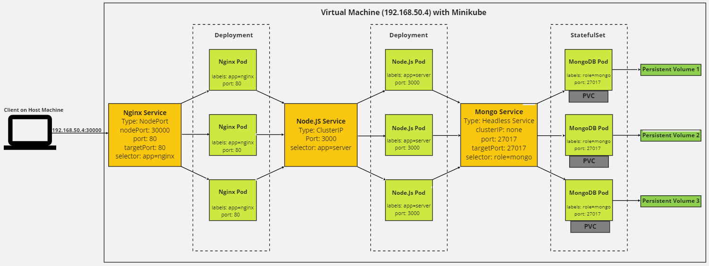

# Project Overview Diagram

# Services Used in this Project

## ClusterIP

Exposes the Service on a cluster-internal IP. Choosing this value makes the Service only reachable from within the cluster. This service, which is Kubernetes's default ServiceType, therefore grants you the ability to pick and choose what someone can access from outside the cluster. For example, in this project, the Node.Js Pods can access the MongoDB pods because they exist in the same cluster. But someone can not directly access the MongoDB database if they are not in the cluster. 

## NodePort 

With the NodePort service, a ClusterIP Service, to which the NodePort Service routes, is automatically created. NodePort can therefore be thought of as an extension of the ClusterIP service, with it granting the extra ability for someone to gain access to a pod from outside the cluster. They can contact the NodePort Service from outside the cluster by using NodeIP:Nodeport (with Nodeport being in the range 30000-32768 - and if one is not specified then a random one from this range will be allocated to the Service). 

## Headless Service

The distinguishing feature of a Headless Service is that it does not have a ClusterIP. One use case of a Headless Service, as exemplified by this project, is for creating StatefulSets. This is because when you perform a DNS lookup for the Headless Service, it returns all of the Pod IPs sitting behind the service, allowing a client to connect to one, many, or all of the Pods. In contrast, if it had a ClusterIP, then when a client performs a DNS lookup for a service, the DNS server returns a single IP — the service’s cluster IP. This will not work for a StatefulSet as each pod is different, and so relying upon loadbalancing (which a ClusterIP Service provides) makes no sense because it matters which pod or pods the client connects with.

# Differences between a Deployment and a Statefulset

| Deployment    | StatefulSet  |
| ------------- |:-------------:|
| Used for stateless applications. | Used for stateful applications. | 
| PersistentVolumeClaim is shared by all Pods. | Unique PersistentVolumeClaim for each Pod.|  
| Pods do not have (or require) a special identity. | Each Pod has a unique and stable network identity.|
| Does not require a Headless Service. | Requires a Headless Service to be responsible for the network identity of the Pods.

# ReplicaSet Diagram

# MongoDB ReplicaSet

A replica set in MongoDB is a group of mongod processes that maintain the same data set. Replica sets provide redundancy and high availability, and are the basis for all production deployments. With multiple copies of data on different database servers, replication provides a level of fault tolerance against the loss of a single database server. Moreover, replication can provide increased read capacity as clients can send read operations to different servers. 

## Structure

### Primary Node

A replica set usually only has one primary node, and it is the only member in the replica set that receives write operations. MongoDB applies write operations on the primary and then records the operations on the primary's oplog.

### Secondary Node

Secondary members replicate the primary's oplog and apply the operations to their data sets.

In this project, the Read Preference (as seen in server.js) is set to primaryPreferred. This means that in most situations, operations read from the primary but if it is unavailable, operations read from secondary members instead.